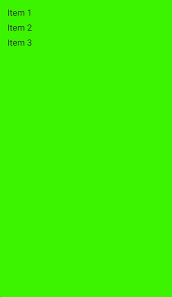
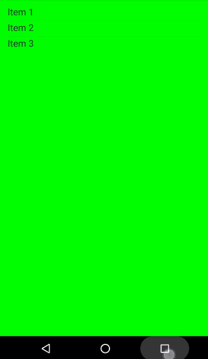

# SwipeFinishableActivity

# What's this?

This library can help you build an Android project with an iOS Navigation Pages like UI style. You can swipe the activity to finish it just like WeChat app does.  



# How to Use?

1. Config application. You can use ```net.println.swipefinishableactivity.SwipableSupportedApplication``` directly in your AndroidManifest.xml. Customed application is also supported and easy to implement, if you want to extend other sub classes of Application. Just follow DempApplication, and create your own:

	```java
	public class DemoApplication extends Application {
	    public static final String TAG = "DemoApplication";
	
	    @Override
	    public void onCreate() {
	        super.onCreate();
	        ActivityController.INSTANCE.onCreate(this);
	    }
	}
	```
2. Create your Activities implementing ```SwipeActivity```, and handle the lifecycle of ```SwipeFinishablePlugin```. You can refer to ```DetailActivity``` to work on your own or just simply extend ```BaseSwipeFinishableActivity```.

	```java
	public class DetailActivity extends Activity implements SwipableActivity {
	    public static final String TAG = "DetailActivity";
	
	    public static final String TITLE = "title";
	
	    SwipeFinishablePlugin plugin = new SwipeFinishablePlugin(this);
	
	    @Override
	    protected void onCreate(Bundle savedInstanceState) {
	        super.onCreate(savedInstanceState);
	        setContentView(R.layout.activity_detail);
	        plugin.onCreate();
			 ...
	    }
	
	    @Override
	    protected void onPostCreate(Bundle savedInstanceState) {
	        super.onPostCreate(savedInstanceState);
	        plugin.onPostCreate();
	    }
	
	    @Override
	    protected void onStart() {
	        super.onStart();
	        plugin.onStart();
	    }
	
	    @Override
	    protected void onStop() {
	        super.onStop();
	        plugin.onStop();
	    }
	
	    @Override
	    public SwipeFinishablePlugin getSwipeFinishablePlugin() {
	        return plugin;
	    }
	
	    @Override
	    public void finishThisActivity() {
	        super.finish();
	    }
	
	    @Override
	    public void finish() {
	        ActivityController.INSTANCE.finishCurrentActivity();
	    }
	}

	```
3. Config the theme of Activities. To make the second top activity visible when swipe the top activity a little, we should make the top one translucent.

	```xml
	<activity android:name=".DetailActivity" android:configChanges="orientation" android:theme="@style/AppTranslucentTheme"/>
	```
	
Done!Hope you enjoy it ~

# Known Issues

1. Since we have no official access to the Activity Task Stack, any recreation of activities may affect the order of the stack we maintained in the ActivityController. For example, if your app supports arbitrary orientations, you should add this configuration to any of your activities in the manifest:

  ``` xml
  android:configChanges="orientation"
  ```

2. ActionBar is not supported and I don't have any plan to work on it. You can just implement an action bar in your own layout.
3. If the theme of the LauncherActivity of your app applied is **Translucent**, the **Recent Activities**(You can see this when you press the **OverView** button besides **Home** button) may looks weird on Google Nexus 6[6.0.1]. This may relate to some bugs in Android System itself, but you can use a non-translucent Activty to avoid this problem.

	

# Compatibility

This project has been developed and tested on Samsung S6 [5.0.1] and Google Nexus 6 [6.0.1]. If you have any problems, create an issue and I will handle it as soon as possible.


